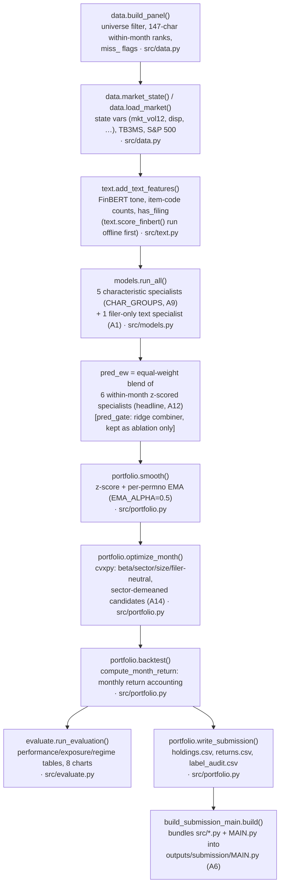

# 0. AlphaBERT — Overview

This is chapter 0 of the AlphaBERT team guide: what the competition asks for, what the
strategy does end to end, why the final design differs from the original plan, a map of
every file in the repo, a glossary of the project's vocabulary, the amendment log, and an
honest statement of what has and has not been run yet.

**Read this first, then go deep in the other chapters:** [`01_data.md`](01_data.md),
[`02_text.md`](02_text.md), [`03_models.md`](03_models.md), [`04_portfolio.md`](04_portfolio.md),
[`05_evaluation.md`](05_evaluation.md), [`06_integrity_and_process.md`](06_integrity_and_process.md),
[`07_running.md`](07_running.md). This chapter names the function at each pipeline step and
links onward; it does not re-derive the math those chapters own.

> **No results exist yet.** As of this writing, `MAIN.py` has never completed an end-to-end
> run under the current (post-amendment) code. Every number quoted below is either a
> configuration constant, a disclosed diagnostic from an old, crashed smoke run (explicitly
> labelled as such), or a fact about the data/repo state verified while writing this chapter.
> See §0.7.

---

## 0.1 The competition, in one page

**Source:** `McGill-FIAM Asset Management Hackathon First Challenge 2026.pdf`, pages 5–22
(the "Stage One" brief). All facts below are taken directly from that PDF; page numbers refer
to it.

**The task** (p.5, p.7): design a **market-neutral U.S. equity** strategy that predicts
next-month stock returns from the supplied characteristics panel and 8‑K filing text, forms a
long–short portfolio from those predictions, and backtests it strictly out-of-sample. The
target is `ret_exc_lead1m` — next month's excess return — renamed `stock_exret` once mapped to
its target month (readme.md §"Target-month alignment"; `docs/SPEC.md` §2).

**Mandate constraints** (p.17–18), enforced every rebalancing month:

| Constraint | Rule | Where enforced in code |
|---|---|---|
| Number of positions | 100–500 names, long + short combined | `src/portfolio.py::_check_constraints` asserts `100 <= n_names <= 500` |
| Gross exposure | ≤ 200% of capital ($100 long + $100 short is the natural centre) | `config.GROSS = 2.0`; long leg sums to +1, short leg to −1 |
| Net exposure | −50% to +50% of capital at every rebalance | the optimizer targets long‑sum=+1/short‑sum=−1 (net ≈ 0), far inside the band |
| Single-name cap | (not stated as a hard rule, but the plan targets ≤1.5%) | `config.MAX_WEIGHT = 0.015` |
| Rebalancing | at least once per half-year; the toolkit rebalances monthly | `src/portfolio.py::backtest` loops monthly over formation months |

A worked example from the rules (p.18): $110 long across 150 names, $90 short across 130
names — gross $200 (200%), net +$20 (+20%), 280 positions — is within every rule.

**The benchmark** (p.8): 3‑month U.S. Treasury bill (`TB3MS`, FRED) plus 4% per annum, expressed
monthly as
$$
\text{bench}_t = \frac{\text{TB3MS}_t}{1200} + \frac{0.04}{12}.
$$
Active return is $\text{active}_t = R_{\text{portfolio,total},t} - \text{bench}_t$. In code:
`src.data.load_market()` computes `rf_m = tb3ms/1200`; `src.portfolio.compute_month_return`
computes `bench_ret = rf_m + config.HURDLE_ANNUAL/12` and `active_ret = total_ret - bench_ret`
— matching the rules formula exactly (`config.HURDLE_ANNUAL = 0.04`).

**The Information Ratio** (p.8, the headline metric):
$$
\text{IR} = \sqrt{12} \times \frac{\text{mean}(\text{active}_t)}{\text{stdev}(\text{active}_t)}.
$$
Computed in `src/evaluate.py::ir`. The rules stress: apply this formula to the *active-return
series*, not to a regression intercept divided by residual volatility (a common mistake with
the legacy `portfolio_analysis_hackathon.py` template, whose printed "Information Ratio" is
actually alpha/residual-vol — see §0.4 below).

**What the judges check** (p.17, p.20–22, p.11): realised beta to the S&P 500 (via OLS of
excess portfolio returns on S&P 500 excess returns — `src/evaluate.py::alpha_beta`, both plain
OLS and Newey–West(3) standard errors); average/max gross and net exposure; position count;
turnover; short-book quality (size, dollar volume, "hard to borrow" concentration); ticker/
company-name labels verified against dated `permno`↔`gvkey`/`iid` links (never a bare ticker
or a later company name); no look-ahead, including *model-side* look-ahead for any pretrained
LLM used (the FinBERT revision pin in `src/text.py`, amendment **A7**, is the project's answer
to this); a research log of what was tried, including failures; and — per p.11 — that
stock-months without a filing are *kept*, not silently dropped, unless the strategy explicitly
restricts the universe and says so (AlphaBERT does the former, and treats "no filing" as a
*state*, never a feature — see **A1** in §0.6).

**Deliverables** (p.20–22): an 8-page deck (+ up to 10-page appendix) in PDF, a holdings CSV
(`Date, PERMNO, TICKER, COMPANY NAME, WEIGHT`, one row per held name per month, 01/2021–08/2026),
a returns CSV, **one file called `MAIN.py`** (no data submitted with it), and team CVs. The
evaluation window is 01/2021–08/2026 inclusive (68 months) — `config.TEST_START = 2021-01-31`,
`config.TEST_END = 2026-08-31`.

---

## 0.2 The strategy, in one paragraph

**A16 update (2026-09-28):** the headline signal described below (`pred_ew`, A12) and the beta
formula it feeds into (A15) were both reverted to their pre-registered design because they were
decided after test-period numbers had been seen; the headline is now `pred_gate` per
`config.HEADLINE_SIGNAL`, with `pred_ew` kept as an ablation -- see docs/research_log.md's dated
A16 entry and docs/SPEC.md section 10. The rest of this paragraph describes the pre-A16 (A12/A15)
design and is left as historical context.

AlphaBERT ranks 147 JKP-style monthly characteristics cross-sectionally and trains five
LightGBM "specialists," one per economically grouped characteristic bucket (value, momentum,
quality, investment/growth, risk/liquidity — **A9**), plus a sixth specialist trained only on
FinBERT sentiment/item-code features extracted from each firm's own 8-K filings that month,
restricted to filer stock-months to avoid a survivorship leak (**A1**). The six specialists'
forecasts are z-scored within each month and simply averaged into the headline signal
(`pred_ew`, an equal weight blend — **A12**, a *post-hoc but disclosed* switch away from the
originally planned regime-conditioned ridge "gate," which is retained only as an ablation).
That signal is EMA-smoothed across months, then handed to a `cvxpy` optimizer each month that
selects roughly 250 long and 250 short candidates per side (demeaned within GICS2 sector first
— **A14**), and maximizes signal exposure subject to dollar-, beta-, sector-, size- and
filer-neutrality (**A10**) at ≤1.5% per name and 200% gross. A month-by-month accounting loop
turns those weights into portfolio returns against the T-bill-plus-4% benchmark, and an
evaluation module produces every statistic and chart the brief asks for before three CSV files
and a bundled `MAIN.py` are written for submission.

For the full mechanics of each box see: data/universe/ranks → `01_data.md`; text/FinBERT →
`02_text.md`; specialists/gate/blend → `03_models.md`; smoothing/optimizer/accounting →
`04_portfolio.md`; tables/charts → `05_evaluation.md`; leakage tests and the amendment process
→ `06_integrity_and_process.md`; how to actually run it → `07_running.md`.

---

## 0.3 How the final design differs from the original plan — and why

The original plan is `Hackathon_Strategy_Recommendation.pdf` (4 pages, read in full while
writing this chapter). It was revised into `docs/SPEC.md` as the team's binding contract, then
amended fourteen times (`docs/SPEC.md` §10, "Amendments (2026-09-27, after Opus spec review)")
after a review pass and, for a few items, after real (validation-window or disclosed
test-window) evidence. Every deviation below is traceable to the PDF page, the SPEC section, or
`docs/research_log.md`.

| Plan item (PDF page) | What AlphaBERT actually does | Reason | ID |
|---|---|---|---|
| 4 characteristic specialists: value/fundamentals, momentum, quality/profitability/accruals, liquidity/risk (p.2) | **5** characteristic specialists: value, momentum, quality, **investment_growth** (new), risk_liquidity; `ebit_bev`/`sale_bev` moved value→quality (profitability/turnover, not price ratios) | Cleaner economic taxonomy (FF5 RMW vs CMA, HXZ ROE vs I/A, Stambaugh–Yuan PERF vs MGMT deserve their own bucket); decided **before** any 2021–2026 result was seen | **A9** |
| "Hold buffer": enter at top/bottom 10% of forecasts, exit only when a stock leaves the top/bottom 20% (p.3) | **Dropped entirely.** Turnover is controlled only by EMA smoothing (`portfolio.smooth`) plus the optimizer's L1 turnover penalty | Judged sufficient without the extra path-dependent state a hold buffer requires | pre-registration (`research_log.md`, no letter) |
| FinBERT embeddings, optionally reduced to 10–20 PCA components (p.2) | **Dropped.** Only tone (`fb_pos - fb_neg` aggregates) + item-code counts + filing counts are used | Keeps the text feature set small and interpretable (SPEC §0: "simplest code that works, no speculative options") | pre-registration |
| Gate: ridge on specialist forecasts × 1–2 state variables, trained on the validation window (p.2) | Built essentially as specified — `config.STATE_VARS = [mkt_vol12, disp]`, `models.fit_gate` is a `RidgeCV` with `GroupKFold` on `eom` — **but it is not the headline** (see next row) | Alpha grid scaled by `n` for comparability across years with very different valid-row counts | **A2**, **A13** |
| No refit on validation stated explicitly | Specialists (and `lgbm_all`) tune `num_leaves`/rounds on an **inner holdout carved from train** (last 12 months), then refit on the full training window; the official 24-month validation window is touched only by the gate and by template-baseline alpha selection | Keeps specialist forecasts on the validation window genuinely out-of-sample for the gate to learn from | **A2** |
| Headline = regime-aware ridge gate over the specialists (p.2, "This is your regime awareness") | Headline signal is **`pred_ew`**, the plain equal-weight blend of the 6 specialist z-scores; the gate (`pred_gate`) is demoted to an ablation/explainability exhibit only | **Post-hoc, disclosed.** Inside a split-half pseudo-OOS test run *within* each 24-month validation window (fit on one half, score the other), equal-weight beat the gate in 5 of 6 years (mean IC 0.044 vs −0.012); mechanically, ~24 monthly observations cannot identify the gate's 18 parameters (cf. DeMiguel, Garlappi & Uppal 2009 on 1/N). Disclosure: an earlier interface smoke run (old, pre-A9 code) had already printed test-period ICs (gate 0.022 vs equal-weight 0.065) before this decision — recorded for candor, but the decision itself cites only validation-window evidence | **A12** |
| Five specialists total (4 characteristic + 1 text) (p.2) | **Six** specialists total (5 characteristic + 1 text), per the A9 row above | — | **A9** |
| Text features incl. a "no filing" flag treated as a state (p.2); use filings within month t | 8-K filing coverage in this retrospectively assembled archive strongly **encodes future survival** (same-month coverage ≈1.3% for a stock's *last* panel row, rising to 59.7% for eventual survivors — `text.filing_coverage_by_exit`); `has_filing` is therefore excluded from every model input (not even as a gate state variable). It survives only as an aux flag: it restricts the text specialist to filer rows, zeroes the text z-score for non-filers, and — new — adds a **filer-net-neutrality** portfolio constraint (`|Σ w · has_filing| ≤ SECTOR_TOL`), because the filer-only z-score design mechanically pushed filers into the signal tails (filer share of top-250 candidates 61% vs 48% base, under `pred_ew`) | Survivorship leak avoidance is stronger than the plan anticipated | **A1**, **A10** |
| LightGBM specialists tuned on validation MSE / early stopping (implicit template convention) | Tuned by **mean monthly Spearman IC** on the inner holdout, evaluated over a fixed rounds grid (100→1000, floor 100), not pooled MSE | Pooled-MSE early stopping was selecting degenerate 1-tree models (as few as 7 distinct predictions) | **A13** |
| Optimizer candidate selection: top/bottom `N_CAND` by raw cross-sectional signal (implicit) | Candidates are selected from the signal **demeaned within GICS2 sector first** (a pure within-sector stock-selection view) | The raw top/bottom-N_CAND set could be sector-lopsided enough (one GICS2 sector 45% of one side's candidates in a sampled month) that the sector-neutrality ladder was infeasible even at its most relaxed rung (worst-sector min net exposure 9.85% vs a 6% cap) in 3–14 of 24 **validation** months per test year — decided without seeing any test-period returns | **A14** |
| FinBERT truncation length not specified | CPU run used `MAX_LENGTH=128` (an "event lead" only, for throughput); once GPU (DGX Spark) scoring removed the compute constraint, moved to `MAX_LENGTH=512` — BERT's own positional-embedding limit, i.e. the *full* cleaned event body — with fp16 precision (checked vs fp32 via `--check` before any full run) | Decided purely on compute/throughput grounds, before any FinBERT score existed | `research_log.md` (2026-09-27 entry), not a lettered amendment |
| Portfolio penalty calibration on 2019–2020 validation predictions, no fitted combiner (SPEC §10 original A3) | Calibrated once on the 2019–2020 `pred_ew` validation signal, but on its **smoothed** form (`portfolio.smooth`), and `calibrate()` now **reuses `backtest()`'s own optimizer call** so it also enforces the A10 filer-net constraint exactly as the real book will | Keeps calibration mechanics identical to the real backtest path | **A3** (amended) |
| Missing next-month returns not addressed | 0-filled in the headline (0.47% of test-universe stock-months, all true exits); an adverse −30%/+30% sensitivity is reported separately; labels are never 0-filled for *training* | Conservative, disclosed treatment of an unavoidable, small data gap | **A4** |
| returns.csv format not fully specified | `Date` matches `holdings.csv` (first of holding month); adds `total_ret_net`/`active_ret_net`; turnover stated as target-to-target, not intra-month drifted; benchmark Sharpe reported N/A; exposure table reports min/avg/max ranges | Removes ambiguity the brief leaves open | **A5** |
| "One file called MAIN.py" (p.22 item 3) | `MAIN.py` is already the single orchestration entry point; `build_submission_main.py` additionally concatenates `src/*.py` + `MAIN.py`'s body into a self-contained `outputs/submission/MAIN.py` needing no `src/` package | Literal compliance — a judge with only that one file can run everything | **A6** |
| "FinBERT's training text predates the 2021 test window" (p.2) as the look-ahead answer | FinBERT is loaded at a **pinned commit revision** (hash recorded in `src/text.py`), `use_safetensors=False` so the pinned `.bin` weights load rather than a newer copy; deck will cite the model's actual pre-2021 training corpora (BERT 2018, TRC2 2008–2010, Financial PhraseBank 2014) | Turns an assertion in the plan into a verifiable, reproducible guard | **A7** |
| "Verify every ticker and company name label...record the source for any unlabeled holding" (p.15, p.20) | Deck-visible holdings whose `label_source` is not the same-month panel label are *supposed to* be verified against SEC EDGAR by CIK, with the URL recorded in `label_audit.csv` | Rules explicitly require this | **A8** — **written into SPEC, not yet implemented in code** (see §0.7) |
| Gate trained on validation window (p.2) | Valid-window predictions are saved for **every** panel row in the valid months, including rows with a null label (future exits) — `run_all`'s `split == 'valid'` frame keeps them — but the gate itself is fit only on the labelled subset | Keeps `preds.parquet` complete for diagnostics even though unlabelled rows can't contribute to a fit | **A11** |

A full timeline of which amendments were decided before vs. after which evidence (including
the exact disclosed smoke-run IC numbers) is in `docs/research_log.md`'s "Disclosure &
timeline" entry — see `06_integrity_and_process.md` for the integrity-process narrative.

---

## 0.4 Repo map

Every file and folder in the repository, what it is, why it exists, and who calls it. Line
counts are from `wc -l` at the time of writing.

### Root

| Path | Lines | What it is | Called by |
|---|---:|---|---|
| `MAIN.py` | 150 | The **single orchestration entry point** (SPEC §9): builds the panel, attaches text, runs models, calibrates and runs the headline + ablation backtests, evaluates, writes the submission. Owns nothing but sequencing — every step is a one-line call into the module that owns the logic. Flags: `--reuse-preds`, `--dry`. | run directly (`python MAIN.py`); bundled by `build_submission_main.py` |
| `build_submission_main.py` | 86 | One-off build script (A6) that embeds `src/config.py, data.py, text.py, models.py, portfolio.py, evaluate.py` and `MAIN.py`'s body as raw-string literals `exec`'d into synthetic modules, producing `outputs/submission/MAIN.py` — a single file needing no `src/` package, for literal compliance with "submit one file called MAIN.py" | run directly; not imported by anything |
| `penalized_linear_hackathon.py` | 189 | **Competition-supplied legacy teaching template** for OLS/Lasso/Ridge/ElasticNet with an expanding-window schedule, on an old `sample_data.csv` / 2000–2024 schema. Referenced (not executed) by `docs/SPEC.md` §5 as the origin of `models.fit_baselines`'s alpha-search idea; its own dates/columns are explicitly obsolete for this competition (rules p.13) | not imported; reference only |
| `portfolio_analysis_hackathon.py` | 111 | **Competition-supplied legacy teaching template** for decile-sort portfolio construction, a CAPM-alpha Newey–West regression, drawdown and a naive turnover count. Its printed "Information Ratio" is alpha/residual-vol, *not* this competition's IR — a trap the rules (p.15) and `src/evaluate.py::IR_FORMULA` both explicitly correct | not imported; reference only |
| `readme.md` | 346 | The **dataset provider's guide** to `chars_final_with_names.parquet` and `8k_..._identified.parquet`: schema, join keys (`permno`/`gvkey`/`iid`/`cusip`/`cik`), timing caveats, target-month alignment, file checksums. The authoritative source for what every raw column means | referenced by every `src/` module's docstrings |
| `pytest.ini` | 7 | Registers the `slow` pytest marker (real-data tests), sets `testpaths = tests` | `pytest` / `python -m pytest` |
| `requirements.txt` | 16 | Python dependencies: pandas, numpy, pyarrow, scikit-learn, matplotlib, jupyter, ipykernel, lightgbm, cvxpy, statsmodels, pytest, duckdb, yfinance, scipy, torch, transformers | `pip install -r requirements.txt` |
| `.gitignore` | — | Excludes `data/` wholesale (provider data, never versioned — WRDS/licence restriction), `*.parquet`/`*.feather`/`*.h5`, `outputs/`, virtual envs, `__pycache__/`, `.vscode/`. **Consequence:** `data/external/*.csv` and `data/external/SOURCES.md`, though small text files, are inside the ignored `data/` tree and are not tracked either | git |
| `Hackathon_Strategy_Recommendation.pdf` | — | The team's original 4-page strategy plan (§0.3's "Plan item" column comes from this file) | superseded in parts by `docs/SPEC.md` |
| `McGill-FIAM Asset Management Hackathon First Challenge 2026.pdf` | 27 pages | The official rules; pages 5–22 are the substantive brief (§0.1 is sourced from it) | governs everything |

### `src/` — the package

| Path | Lines | Owns | Called by |
|---|---:|---|---|
| `src/__init__.py` | 0 | marks `src` as a package | — |
| `src/config.py` | 59 | **Constants and paths only** (SPEC §0): `ROOT`/`DATA_DIR`/`CACHE_DIR`/`FIG_DIR`/`TABLE_DIR`/`SUB_DIR`, `SEED=42`, `TEST_YEARS=2021..2026`, `FIRST_TARGET`, `TEST_START`/`TEST_END`, `MISS_FLAG_CUTOFF`/`RATE`, `MIN_PRICE=$5`, `ME_CUTOFF_PCTILE=0.20`, `BETA_SHRINK=0.33`, `KEY_ITEMS` (12 8-K item codes), `STATE_VARS`, `GROSS=2.0`, `MAX_WEIGHT=0.015`, `N_CAND=250`, `EMA_ALPHA=0.5`, `TURNOVER_PENALTY`/`L2_PENALTY` (placeholders, locked by `MAIN.py` step 4), `BETA_TOL`/`SECTOR_TOL`/`SIZE_TOL`, `COST_BPS=10`, `HURDLE_ANNUAL=0.04`, `N_JOBS=6`, `load_char_list()` | every other module, `MAIN.py` |
| `src/data.py` | 218 | Panel construction: `load_chars`, `universe_mask`, `_rank_within_eom`, `_build`/`build_panel` (cached at `outputs/cache/panel.parquet`), `feature_columns`, `market_state`, `load_market`/`_download_market_data` (caches to `data/external/`) | `MAIN.py` step 1; `models.py` (`feature_columns`); `text.py`'s `filing_coverage_by_exit` |
| `src/text.py` | 618 | `clean_text`, FinBERT scoring (`score_texts`, `score_finbert`, `check_precision`, `chunk_dir_for`, `scores_path_for`), `build_text_features`, `add_text_features`, `filing_coverage_by_exit` (the A1 diagnostic), a `python -m src.text --score/--check` CLI | `MAIN.py` step 2; `models.py` imports `TEXT_FEATURES` |
| `src/models.py` | 507 | `CHAR_GROUPS` (A9's 5 groups), `splits`, `make_target`, `fit_baselines`, LightGBM specialist tuning (`_fit_lgbm_tuned`/`_fit_specialist`, A13), the gate (`_zscore_by_eom`, `fit_gate`, A2/A13), `run_all` (writes `preds.parquet` + `gate_coefs.parquet`), `oos_r2`/`monthly_ic`/`r2_table` | `MAIN.py` step 3 |
| `src/portfolio.py` | 435 | `smooth` (EMA), `optimize_month` (cvxpy neutral optimizer, A14 sector-demeaning, A10 filer-net constraint, the `RELAX_STEPS` ladder), `compute_month_return`/`backtest` (accounting), `missing_return_sensitivity` (A4), `calibrate` (A3), `load_label_sources`/`attach_labels` (label provenance), `write_submission` (A5/A6 format) | `MAIN.py` steps 4–8 |
| `src/evaluate.py` | 470 | `performance_table`, `alpha_beta` (OLS + Newey–West(3)), `calendar_year_table`, `exposure_table`, `short_book_table`, `contributors`, `top_holdings`, `regime_table`, `ablation_table`, `gate_weight_series`, every `plot_*` chart function, `run_evaluation` (orchestrates, writes CSVs/PNGs) | `MAIN.py` step 7 |

### `tests/` — one file per module + the leakage suite

| Path | Lines | Covers |
|---|---:|---|
| `tests/__init__.py` | 0 | package marker |
| `tests/conftest.py` | 10 | puts repo root on `sys.path`; re-registers the `slow` marker |
| `tests/test_data.py` | 390 | rank-transform math, `universe_mask` never touching `stock_exret`, miss-flag selection window, beta shrink/`gics2` NA handling, and `@pytest.mark.slow` checks against the **real** parquet files (unique keys, `stock_exret == next-month ret_exc`, market-data coverage, truncation invariance) |
| `tests/test_text.py` | 595 | exhaustive `clean_text` unit tests (cover-page drop, tail cut, boilerplate stripping, name/ticker masking, TOC handling), `score_texts` NaN-for-empty behaviour, `build_text_features` joins, chunked/resumable scoring, plus slow real-data shape/bounds tests and `filing_coverage_by_exit` |
| `tests/test_models.py` | 433 | `CHAR_GROUPS` partitions all 147 chars exactly once (A9), `splits` schedule vs SPEC §2, `make_target`, the `oos_r2` formula, z-score-for-NaN, a full synthetic `run_all` with a **planted signal** (checks the gate/specialists actually recover it), `r2_table` NaN handling for `pred_ew` |
| `tests/test_portfolio.py` | 579 | `optimize_month` constraints incl. the A14 sector-demeaning regression test and the A10 filer-net test, the relaxed-tolerance-bug regression test (`test_optimize_month_forces_sector_relaxation` — see the research-log bug writeup), hand-computed `compute_month_return`/`backtest`, smoothing, label attachment, submission-file rounding |
| `tests/test_evaluate.py` | 379 | every stat function hand-computed against known inputs (`ir`, `sharpe`, `alpha_beta` via planted OLS values, drawdown, calendar-year compounding incl. the 2026 YTD label, `gate_weight_series`) |
| `tests/test_integrity.py` | 505 | **the leakage suite** (SPEC §8): target alignment vs. raw data, truncation invariance across panel/market_state/text, universe invariance to NaN'd `stock_exret`, feature-column hygiene, schedule assertions, the shuffled-label IC test, holdings constraint checks — mostly `@pytest.mark.slow` |

### `docs/`

| Path | Lines | What it is |
|---|---:|---|
| `docs/SPEC.md` | 111 | The shared contract (this document's own source of truth); §10 holds amendments **A1–A14** |
| `docs/research_log.md` | 82 | Dated log entries justifying each amendment, including the disclosed pre-decision smoke-run IC table and the A1 numbers correction |
| `docs/RUN_FINBERT_DGX.md` | 126 | Runbook for scoring all 373,139 filings on the DGX Spark GPU (not yet executed — see §0.7) |
| `docs/smoke_run_oos_r2_2026-09-27.csv` | 15 | The frozen, disclosed OOS R2/IC table from the crashed pre-A9 smoke run. **Byte-identical** (verified by `diff`, this session) to the still-on-disk `outputs/tables/oos_r2.csv` — i.e. no real run has overwritten it since |
| `docs/guide/` | — | This chapter and its siblings — see `README.md` in this folder for the reading order |

### `notebooks/`

| Path | What it is |
|---|---|
| `notebooks/01_data_exploration.ipynb` | 48 cells, French-language, early **pre-pipeline EDA** of `chars_final_with_names.parquet` only: schema, missingness, cardinality, target-month coverage, distributions. Explicitly does no modelling, splitting or imputation. Not part of the reproducible pipeline — `MAIN.py` never reads it |

### `data/` (gitignored — provider data, never versioned)

| Path | Size / rows | What it is |
|---|---|---|
| `data/chars_final_with_names.parquet` | 413 MB, 529,082 × 198 | The monthly characteristics panel; source of everything in `data.build_panel` |
| `data/8k_20150101_20260831_identified.parquet` | 358 MB, 373,139 × 94 | The linked 8-K filing archive; source of every `src/text.py` input |
| `data/factor_char_list.csv` | 148 lines | The 147 canonical characteristic names; read by `config.load_char_list()` |
| `data/external/SOURCES.md`, `tb3ms.csv` (1,113 lines, back to 1934), `sp500.csv` (142 lines) | small | Cached market-data downloads, auto-written by `data._download_market_data()`. Confirmed (this session) `sp500_source = 'sp500tr_total_return'` — the primary `yfinance ^SP500TR` path succeeded; the FRED price-only fallback was **not** used |

### `outputs/` (gitignored — `config.py` recreates the four subfolders on import)

| Path | State (verified this session) |
|---|---|
| `outputs/cache/panel.parquet` | **Present**, 373 MB, built 2026‑09‑27 11:54. Note: `build_panel()` has **no mtime staleness guard** against `src/data.py` (unlike the explicit check `MAIN.py` performs on `preds.parquet` vs. `src/models.py` for `--reuse-preds`); this cache predates the same day's last edit to `data.py` (22:14). A spot check found the expected `prc_raw`/`dolvol_126d_raw` columns present, so it is not visibly broken, but it should be rebuilt (delete the file) before trusting a final run. Note also that a fresh clone (e.g. on the DGX) has no `outputs/` at all, so the panel is rebuilt from scratch there; locally, delete `outputs/cache/panel.parquet` before the final run |
| `outputs/cache/finbert_chunks/` | 5 stray `part_*.parquet` files with **no `_L` suffix** — orphaned artifact from a pre-refactor version of `text.py` (before `chunk_dir_for()` was parametrized by `max_length`; confirmed by `outputs/cache/finbert.log`'s print format, which lacks the current code's `max_length=/device=/dtype=` fields). **Never read** by the current code |
| `outputs/cache/finbert_chunks_L512/` | **Does not exist yet** — no chunk of the current-code, 512-token GPU run has been written |
| `outputs/cache/finbert_smoke/` | A 600-row CPU smoke test of the *current* cleaning/masking/scoring code path, produced by a since-removed `--limit` smoke flag (the flag no longer exists in `src/text.py`'s CLI), confirming the pipeline works end to end |
| `outputs/cache/finbert.log` | Captured stdout of the interrupted legacy CPU run: 5 of 374 chunks (~5 docs/s), consistent with `docs/research_log.md`'s "~20h ETA" note |
| `outputs/cache/preds.parquet`, `gate_coefs.parquet` | **Absent** — `models.run_all()` has not completed under the current 5-specialist (A9) code |
| `outputs/figures/` | **Empty** |
| `outputs/tables/oos_r2.csv` | **Present but stale**: byte-identical to `docs/smoke_run_oos_r2_2026-09-27.csv`, the disclosed pre-A9, 4-specialist, MSE-tuned smoke run that crashed in portfolio calibration — not a current-code result |
| `outputs/submission/MAIN.py` | **Present** (123,189 chars), built 2026‑09‑28 09:03 — postdates every `src/*.py` file, so the *bundle itself* is current. It has never been *run*, and it bundles model code whose outputs (`preds.parquet`, holdings, returns) don't exist yet either |
| `outputs/hf_cache/` | Populated — the pinned FinBERT weights have been downloaded locally at least once (used for the CPU legacy run and the smoke test) |

---

## 0.5 Key conventions glossary

| Term | Meaning |
|---|---|
| `eom` | End-of-month timestamp labelling a **formation month** $t$: every feature on the row dated `eom=t` uses only information available by the end of month $t$ (`docs/SPEC.md` §2). |
| **formation month** | Same as `eom` — the month whose characteristics form the prediction and whose portfolio positions are *set* at month-end. |
| `target_month` | `eom + 1 month` — the month whose realized return the model is trying to predict, and whose return the portfolio actually *earns*. Computed once as `eom + pd.offsets.MonthEnd(1)` in `data._build`; never re-derived. |
| **holding month** | Same concept as `target_month`, used when talking about the *portfolio* rather than the *model*: positions formed at the end of formation month $t$ are held during holding month $t+1$. |
| `stock_exret` | The model's regression target = `ret_exc_lead1m` from the raw panel — next month's excess return, already led once. **Never shift it again**; never use it as a predictor (readme.md, SPEC §2). |
| **universe** | The set of stock-months eligible to be traded: `prc ≥ $5` and `me` ≥ the 20th percentile of `me` within that `eom` (`data.universe_mask`). Decided from month-$t$ information only, **never** from whether `stock_exret` exists. |
| **Z-score (within `eom`)** | $(x - \bar x_{\text{month}}) / \sigma_{x,\text{month}}$, computed cross-sectionally within each month — used to make specialist forecasts comparable before blending (`models._zscore_by_eom`) and again before EMA smoothing (`portfolio.smooth`). |
| **IC** | Information Coefficient — the monthly Spearman rank correlation between a forecast and `stock_exret` within that month (`models.monthly_ic`). Reported as a mean and a $t$-stat (`ic.mean() / (ic.std(ddof=1)/\sqrt n)`) across months. |
| **OOS R²** | The brief's *zero-benchmark* out-of-sample R²: $R^2_{OOS} = 1 - \frac{\sum (r - \hat r)^2}{\sum r^2}$ — no historical-mean subtraction in the denominator, so even a small positive value means genuine predictability (`models.oos_r2`; rules p.14). |
| **filer** | A `(permno, eom)` stock-month with at least one 8-K filing dated inside that calendar month (`has_filing == 1`, from `text.build_text_features`). Filer status is *not* a model feature (A1) — only a gate on which rows the text specialist sees, and a portfolio neutrality group (A10). |
| **gross / net** | Gross exposure = $\sum |w_i|$ (target 200%, `config.GROSS`); net exposure = $\sum w_i$ (targeted at ≈0, the long and short legs summing to exactly +1/−1 by construction, well inside the mandate's ±50% band). |
| **active return** | $\text{total\_ret}_t - \text{bench\_ret}_t$ — the quantity the Information Ratio is computed over (§0.1). |
| **specialist** | One LightGBM model trained on a single feature group — the 5 `CHAR_GROUPS` (A9) or the filer-only text feature set — via `models._fit_specialist`. |
| **gate** | The (now ablation-only) ridge combiner over the 6 specialists' z-scores and their interactions with `config.STATE_VARS`, fit on the validation window (`models.fit_gate`, A12). |
| **candidate set** | The `N_CAND=250` names per side (long/short) the optimizer is allowed to pick nonzero weight for, selected from the sector-demeaned signal (A14). |
| **relax / relaxation ladder** | `portfolio.RELAX_STEPS`: if the base sector/size/beta tolerances make a month infeasible, the solver retries with sector tolerance doubled, then size, then beta, in that order, and records which step it needed. |
| **dust** | Optimizer weights with $|w| < 10^{-5}$ — solver noise, zeroed out and each leg rescaled back to exactly ±1 (`portfolio.DUST`, `_dust_and_rescale`). |
| **label_source** | Where a holding's ticker/company name came from: `'panel'` (same-month characteristics row), `'raw_panel'`/`'filing'` (most recent earlier label, `asof`-filled), or `'UNLABELED'`. Recorded per holding in `label_audit.csv`. |
| **hurdle** | The 4%/year premium in the benchmark (`config.HURDLE_ANNUAL`), on top of the T-bill rate. |
| **capital convention** | $100 capital, $100 long, $100 short; collateral earns the T-bill rate; `total_ret = rf_m + ls_ret` (SPEC §6). |

---

## 0.6 The decision log at a glance — amendments A1–A14

All from `docs/SPEC.md` §10, cross-checked against `docs/research_log.md`. "Pre-hoc" means
decided before any 2021–2026 test-period result existed (even if validation-window evidence was
used); "post-hoc, disclosed" means test-period evidence had already been seen (even
incidentally, via a crashed smoke run) before the decision, and that fact is recorded rather
than hidden.

| ID | Decision | Why | Timing |
|---|---|---|---|
| **A1** | Drop `has_filing` as a feature entirely; `text.TEXT_FEATURES` = filer-only within-filing features; text specialist trains/predicts on filer rows only; its z-score is 0 for non-filers | Retrospectively assembled 8-K coverage encodes future survival: 1.3% same-month coverage right before a permno's last panel row vs 59.7% for eventual survivors (`text.filing_coverage_by_exit`) | Pre-hoc (numbers corrected once, see the 2026‑09‑27 "A1 correction" log entry — qualitative conclusion unchanged) |
| **A2** | Specialists/`lgbm_all` tune on an inner 12-month holdout of train, refit on full train; the 24-month validation window is reserved for the gate and template-baseline alpha; gate ridge alpha via `GroupKFold` on `eom` | Keeps specialist forecasts on validation genuinely out-of-sample for the gate | Pre-hoc |
| **A3** | Portfolio penalties (`L2_PENALTY`, `TURNOVER_PENALTY`) calibrated once on the smoothed 2019–2020 `pred_ew` validation signal, via `calibrate()` reusing `backtest()`'s own optimizer call (so A10 is enforced during calibration too), then locked | Calibration mechanics should match the real backtest path exactly | Pre-hoc — "decided without seeing any test-period returns" |
| **A4** | Missing next-month returns (0.47% of test-universe stock-months, all true exits) stay 0 in the headline; a −30%/+30% adverse sensitivity is reported separately; never 0-filled for training | Conservative, disclosed treatment | Pre-hoc |
| **A5** | `returns.csv`: `Date` = first of holding month (matches `holdings.csv`); adds `total_ret_net`/`active_ret_net`; turnover stated as target-to-target; benchmark Sharpe reported N/A; exposure table reports min/avg/max | Removes format ambiguity | Pre-hoc |
| **A6** | Final integration step bundles all `src/` modules into one self-contained `outputs/submission/MAIN.py` | Rules require exactly one file called `MAIN.py` | Pre-hoc |
| **A7** | FinBERT pinned to a specific revision hash (recorded in `src/text.py`); deck cites its pre-2021 training corpora | Model-side look-ahead guard, independent of the train/valid/test split | Pre-hoc |
| **A8** | Deck-visible holdings whose `label_source` isn't the same-month panel label get verified against SEC EDGAR by CIK, URL recorded in `label_audit.csv` | Rules require verified labels for any unlabeled/uncertain holding | Pre-hoc — **not yet implemented in code** (§0.7) |
| **A9** | Five characteristic specialists (value, momentum, quality, investment_growth, risk_liquidity); `ebit_bev`/`sale_bev` move value→quality; headline = gate/blend over 6 specialists | Cleaner economic taxonomy | Pre-hoc ("decided on economic grounds... before any 2021–2026 result was seen"); **implemented** after the disclosed smoke-run table existed (§0.3) |
| **A10** | Filer-net-neutral portfolio constraint: `|Σ w · has_filing| ≤ SECTOR_TOL`, on the same relaxation ladder as sectors | The filer-only text z-score mechanically concentrates filers in the signal tails (61% vs 48% base, top-250 under `pred_ew`) | Pre-hoc |
| **A11** | Valid-window predictions saved for every row including null-label future exits; gate fit only on the labelled subset | Keeps `preds.parquet` complete/consistent | Pre-hoc |
| **A12** | Headline switched from the ridge gate to `pred_ew` (equal-weight blend); gate kept as ablation only | Split-half pseudo-OOS inside each validation window: equal-weight beat the gate in 5/6 years, mean IC 0.044 vs −0.012; ~24 obs can't identify 18 gate params | **Post-hoc, disclosed** (validation-window evidence cited; a prior smoke run had incidentally shown test-period ICs, disclosed for candor but not the stated basis) |
| **A13** | Specialist rounds/`num_leaves` chosen by mean monthly Spearman IC on the inner holdout, fixed rounds grid (100–1000), not pooled MSE; gate ridge alpha grid scaled by `n` | MSE early stopping was selecting degenerate 1-tree models | **Post-hoc, disclosed** — motivated by the 1-tree failure mode found in validation diagnostics, decided after the smoke-run table existed |
| **A14** | Optimizer candidate selection uses the signal demeaned within GICS2 sector | Raw top/bottom-N_CAND was sector-lopsided enough to make the sector constraint infeasible in 3–14/24 **validation** months per test year (worst-sector min net exposure 9.85% vs 6% cap after full relaxation) | Pre-hoc — "decided without any test-period returns" |

See `06_integrity_and_process.md` for the full narrative (including the exact disclosed
IC numbers and the `_check_constraints` relaxed-tolerance bug found and fixed the same day).

---

## 0.7 Current status — what's done, what's not

Verified in this session (2026-09-28):

**Done / working:**
- The full `src/` package (data, text, models, portfolio, evaluate) and `MAIN.py` are written
  and internally consistent with `docs/SPEC.md` (with the one exception noted below, A8).
- The **fast** test suite passes: `python -m pytest -q -m "not slow"` → **88 passed, 19
  deselected**, this session.
- `outputs/cache/panel.parquet` exists (a completed `data.build_panel()` run), so `data.py`'s
  logic has run successfully against the real characteristics file at least once — though see
  the staleness caveat in §0.4.
- A CPU smoke test of the *current* `text.py` cleaning/masking/scoring code
  (`outputs/cache/finbert_smoke/`, 600 rows) confirms that pipeline works end to end.
- `outputs/submission/MAIN.py` builds successfully and is up to date relative to the current
  `src/*.py` (it was built after all of them).

**Not done yet:**
- **FinBERT full scoring is pending.** No `finbert_scores_L512.parquet` exists. The only
  scoring done is (a) an interrupted legacy CPU run at 5/374 chunks under an older code
  version, and (b) the 600-row smoke test above. The DGX GPU run (`docs/RUN_FINBERT_DGX.md`)
  has not been executed. **Consequence:** if `MAIN.py` were run today, `tone_mean`,
  `tone_min`, `fb_neg_max` would be entirely absent from the panel — the text specialist
  would train on filing/item counts only, no sentiment.
- **No full `MAIN.py` run exists under the current (post-A9/A10/A13/A14) code.** The only
  OOS R²/IC numbers anywhere in the repo (`outputs/tables/oos_r2.csv`,
  `docs/smoke_run_oos_r2_2026-09-27.csv` — byte-identical) come from an old, 4-specialist,
  MSE-tuned, no-tone smoke run that **crashed during portfolio calibration**. They are
  disclosed for candor in `docs/research_log.md` but are **not** current-model results and
  must not be quoted as such.
- `outputs/cache/preds.parquet`, `gate_coefs.parquet`, `holdings.csv`, `returns.csv`,
  `label_audit.csv`, `performance_table.csv`, and every evaluation chart PNG: **none exist
  yet**. No final performance numbers (IR, Sharpe, alpha, beta, etc.) exist for this strategy.
- **The deck (PowerPoint) has not been started.** The only PDFs in the repo are the source
  rules and the original strategy plan, not a submission deck.
- **Amendment A8 (SEC EDGAR label verification) is written into `docs/SPEC.md` and
  `docs/research_log.md` but is not implemented in code.** A repo-wide search for
  `EDGAR`/`edgar` in `src/`, `MAIN.py`, and `build_submission_main.py` returns nothing, and
  `portfolio.write_submission`'s `label_audit.csv` has columns `permno, month, ticker,
  company_name, label_source` only — no EDGAR URL/verification column. This needs to be
  built before any deck cites an EDGAR-verified label.
- The slow test suite (`@pytest.mark.slow`, mostly `tests/test_integrity.py` plus slow cases
  in `test_data.py`/`test_text.py`, 19 tests) passed 19/19 (~6 min) in the final integration
  pass on 2026-09-27, together with 88/88 fast tests.
- `config.TURNOVER_PENALTY = 0.5` and `config.L2_PENALTY = 100.0` are explicitly commented
  `# placeholder, calibrated later on 2019-2020 validation only` — they have not yet been
  locked by an actual `calibrate()` run under current code.

In short: the code and its safety net (tests, amendment trail) are mature; the *numbers* — the
whole point of a hackathon submission — do not exist yet. Treat every discussion of "how the
strategy performs" until `MAIN.py` has completed a full run as **design intent**, not result.
